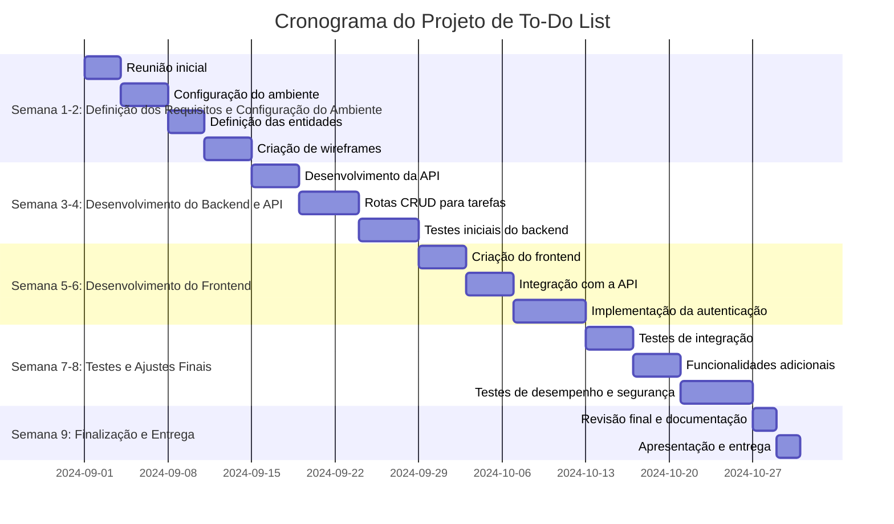
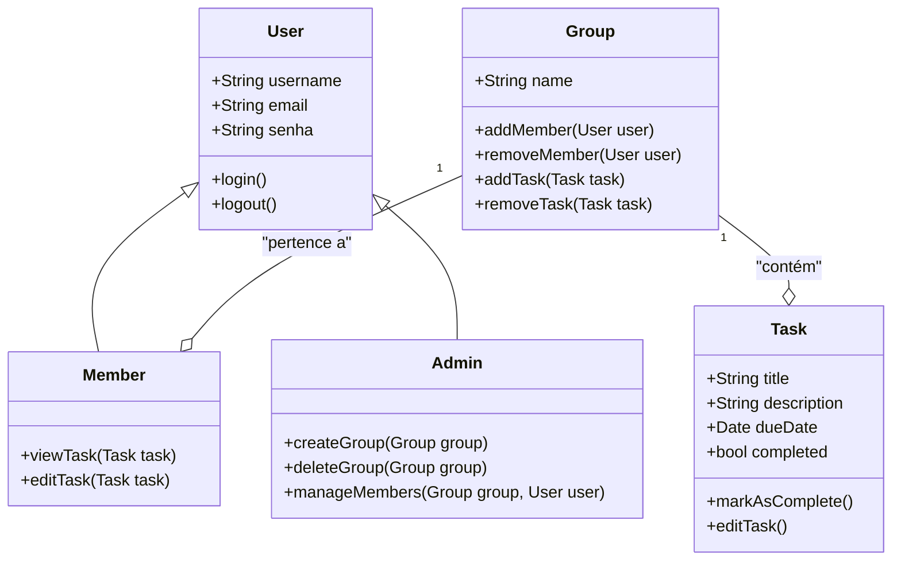
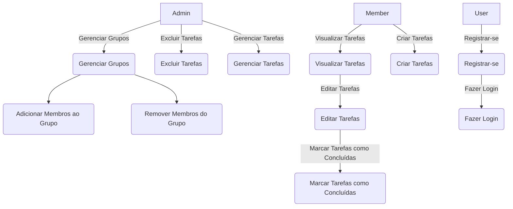

# Projeto: Aplicação Web de To-Do List

## Escopo

O projeto consiste no desenvolvimento de uma aplicação web de To-Do List que permite aos usuários gerenciar suas tarefas de forma simples e eficiente. O sistema incluirá funcionalidades como criação, edição e exclusão de tarefas, categorização por prioridades, autenticação de usuários, e uma interface de usuário responsiva. A aplicação utilizará React no frontend, Node.js no backend, MongoDB como banco de dados e JWT para autenticação. O objetivo é garantir segurança, escalabilidade e uma experiência de usuário fluida.

## Objetivos

- **Específico:** 
  - Implementar um sistema de gerenciamento de tarefas que permita aos usuários criar, editar, excluir e organizar suas tarefas, com autenticação segura e interface amigável.

- **Mensurável:** 
  - Garantir que 95% dos testes de CRUD sejam bem-sucedidos até o final da semana 4.
  - Completar a integração de JWT para autenticação de usuários, com 100% de precisão nos dados, até o final da semana 6.

- **Atingível:** 
  - Finalizar o desenvolvimento da interface do usuário até o final da semana 3, garantindo que ao menos 90% das funcionalidades sejam implementadas e testadas sem erros.

- **Relevante:** 
  - Desenvolver uma API robusta e escalável para gerenciar as operações de tarefas e usuários, garantindo que o sistema suporte um grande número de usuários simultâneos.

- **Temporal:** 
  - Concluir o projeto dentro de 60 dias, entregando um sistema completamente funcional e pronto para ser utilizado no mundo real até o dia 60.

## Cronograma

### Semana 1-2 (Dias 1-14): Definição dos Requisitos e Configuração do Ambiente

- **Dias 1-3:** Reunião inicial para definição de requisitos e funcionalidades principais.
- **Dias 4-7:** Configuração do ambiente de desenvolvimento (Node.js, MongoDB, React).
- **Dias 8-10:** Definição das entidades principais (usuários, tarefas) e modelagem do banco de dados.
- **Dias 11-14:** Criação de wireframes e protótipos iniciais da interface do usuário.

### Semana 3-4 (Dias 15-28): Desenvolvimento do Backend e API

- **Dias 15-18:** Desenvolvimento da API para gestão de usuários e autenticação com JWT.
- **Dias 19-23:** Implementação das rotas CRUD para tarefas, incluindo validações e manipulação de dados no MongoDB.
- **Dias 24-28:** Testes iniciais do backend, incluindo verificação de segurança e escalabilidade.

### Semana 5-6 (Dias 29-42): Desenvolvimento do Frontend

- **Dias 29-32:** Criação da estrutura do frontend em React, incluindo componentes básicos.
- **Dias 33-36:** Integração do frontend com a API, permitindo que os usuários visualizem e interajam com suas tarefas.
- **Dias 37-42:** Implementação da autenticação de usuários no frontend utilizando JWT e testes de fluxo.

### Semana 7-8 (Dias 43-56): Testes e Ajustes Finais

- **Dias 43-46:** Testes de integração entre frontend e backend, corrigindo quaisquer problemas identificados.
- **Dias 47-50:** Implementação de funcionalidades adicionais, como filtro de tarefas por prioridade e categorias.
- **Dias 51-56:** Testes de desempenho e segurança, além de ajustes finais na interface e na API.

### Semana 9 (Dias 57-60): Finalização e Entrega

- **Dias 57-58:** Revisão final do sistema, documentação e preparação para a entrega.
- **Dias 59-60:** Apresentação da aplicação e entrega oficial do projeto.
  
** Diagrama de Gantt **

## Recursos

- **Tecnológicos:**
  - **React:** Framework para o desenvolvimento da interface do usuário.
  - **Node.js:** Ambiente de execução para o backend, utilizando Express para criação da API.
  - **MongoDB:** Banco de dados NoSQL para armazenar informações sobre usuários e tarefas.
  - **JWT (JSON Web Tokens):** Utilizado para autenticação segura de usuários.
  - **Visual Studio Code:** IDE para desenvolvimento e gerenciamento de código.
  - **Thunder:** Ferramenta para testes de API.

- **Humanos:**
  - **Desenvolvedores Full-Stack:** Especializados em Node.js, React e MongoDB.
  - **Gerente de Projetos:** Responsável por coordenar as atividades e garantir a entrega dentro do prazo.
  - **Analista de Qualidade:** Realiza testes e validação do sistema.
  - **Especialistas em Segurança:** Garantem a implementação de boas práticas de segurança no sistema.

- **Materiais:**
  - **Servidores e Infraestrutura:** Hospedagem da aplicação e do banco de dados.
  - **Documentação:** Guias de uso e documentação técnica.

## Análise de Riscos

1. **Conflitos no Gerenciamento de Tarefas:**
   - **Impacto:** Médio. Erros na manipulação de tarefas podem comprometer a usabilidade.
   - **Mitigação:** Implementação de testes unitários rigorosos e validação de dados.

2. **Segurança dos Dados dos Usuários:**
   - **Impacto:** Alto. Vazamento de dados de usuários pode comprometer a confiança no sistema.
   - **Mitigação:** Uso de criptografia e autenticação segura com JWT, além de revisões de segurança.

3. **Escalabilidade do Sistema:**
   - **Impacto:** Médio-Alto. Um grande volume de usuários pode afetar o desempenho.
   - **Mitigação:** Otimização de consultas e planejamento de escalabilidade horizontal.

4. **Integração do Frontend com Backend:**
   - **Impacto:** Médio. Falhas de comunicação entre frontend e backend podem causar bugs.
   - **Mitigação:** Testes de integração contínuos e validação de fluxos de dados.

5. **Atrasos no Cronograma:**
   - **Impacto:** Médio. Atrasos podem comprometer a entrega.
   - **Mitigação:** Monitoramento rigoroso do cronograma com ferramentas de gerenciamento de tarefas.

## Diagramas

**Diagrama de Class**

** Diagrama de uso **

## Manual de Identidade Visual

**Cores:**

-  #fcfcfc - White
-  #666370 - Dim Grey
-  #1c1f33 - Space Cadet

